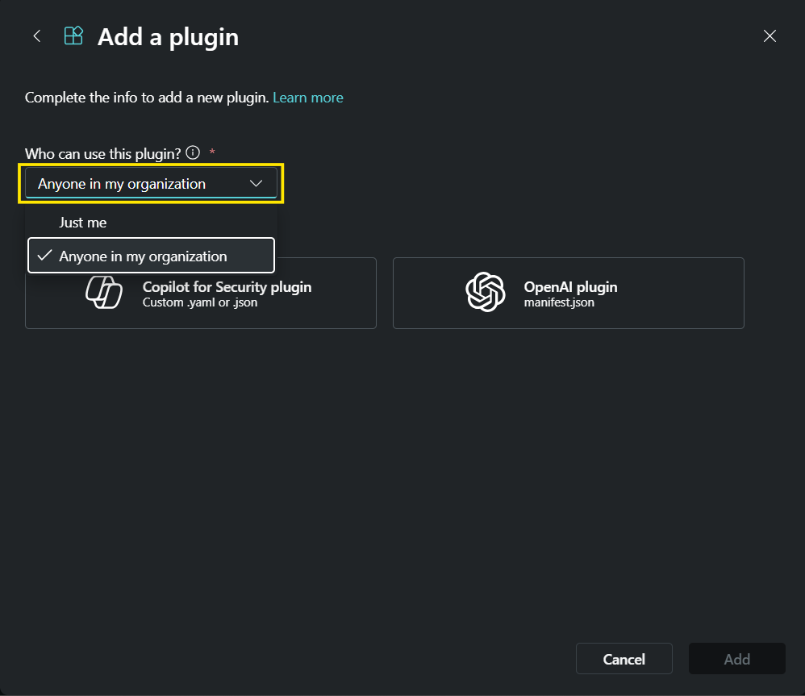

#### The Scout plugin enables Copilot for Security customers to gather detailed threat intelligence on IP addresses and domains in real-time. Scout delivers unparalleled speed, accuracy, and visibility, helping security analysts make faster, better-informed decisions. Scout’s powerful features ensure that security teams can stay ahead of evolving cyber threats. It provides insights into malicious IP activity, domain information, open ports, communication, and more. With AI-enriched data from sources like Passive DNS and cryptographic certificates, it helps security teams detect and block harmful IPs, streamlining investigations and improving response times. 

### Pre-requisites

#### Pure Signal Scout Plugin [Manifest File](<LINK>)

#### API Key

Steps to generate Key :

1. Open https://scout.cymru.com

 

 

2. Use username and password to log in.

3. Open https://scout.cymru.com/api_keys and click Create.

 
 

4. Add a key description

 

5. Copy API Key.

 

    

### Instructions

#### Upload the Custom Plugin

1. Obtain the file [scout-manifest.yaml](<LINK>) from this directory.
    
2. Click on add plugin in Security Copilot
   
    
3. Go to custom tab and click on upload plugin.
   
    
4. Set up the scope of plugin to person use or Organization.
   
    
5. Enter [API key](https://scout.cymru.com/api_keys) of Scout in value field.
   
    
6. Enable the plugin with the toggle button.
   
    

### Plugin Utilization cases

#### Scout Query Language Prompt

* Use Pure Signal Scout plugin and Scout Query Language to run the query comms.ip="104.18.213.12/24" on Scout to fetch
  the records from the last 1 day.
   
* Use Pure Signal Scout plugin and Scout Query Language to run a query comms.ip="104.18.213.12/24" on Scout and generate
  a report in table format displaying the domains.

 

 

#### IP Details

* Use the Scout Plugin, Analysis the IP detail of 192.42.116.179. Give me the summary section of the IP Address.
   
* Use Scout plugin Fetch the detail about IP 192.42.116.179. Explore the summary and list of all the tags related to
  this IP Address.
   
* Use Scout plugin to Fetch the details about IP 192.42.116.179. Explore the summary and list of all the tags related to
  this IP Address. Only return the tags corresponding to the IP Address in json format.
   
* Use Scout Plugin, Analyze the given IP Address and provide open ports details for IP 192.42.116.179 from 2024-06-01
  to 2024-06-07.

 

 

#### Foundation API

* Create a report of foundation detail of the following IPs 185.220.100.240, 185.220.101.7 and list down the overall rating
  corresponding to the IP Address in tabular form.
   
* Create a report of foundation detail of the following IPs 185.220.100.240, 185.220.101.7 and list down the overall
  rating corresponding to the IP Address in Json Format. Also include the insight corresponding to every IP in Json
  format.
   
* List out the critical information about the IPs 185.220.100.240, 185.220.101.7 and build the report which contains the
  IP Address and its corresponding all tag names in json format. Only give the IP Address and all tag names corresponding
  to IP. The tag name should be in List format.
   
* Create the report in the format of a table which contains the Country code with name, Autonomous System Name
  corresponding to IP Address. Make the First column as IP Address, then Autonomous System Name and then Country Code
  with name in the next column subsequently. Use FoundationDetail API to get the data. Here is the IP Address
  192.42.116.212 192.42.116.200 192.42.116.199 192.42.116.221

 

 
